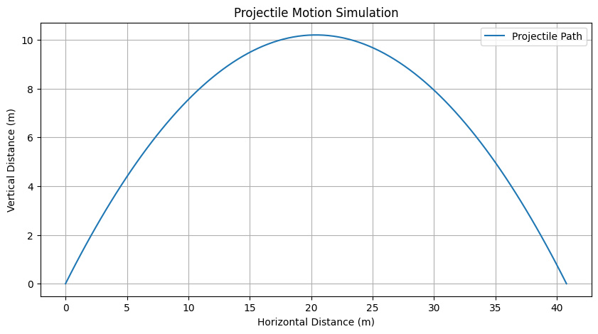
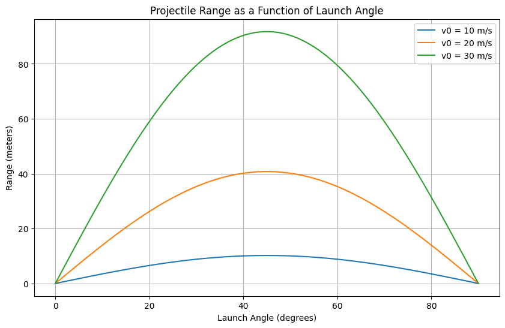

# Problem 1
# Mechanics

## Problem 1: Investigating the Range as a Function of the Angle of Projection

### 1. Theoretical Foundation

To derive the governing equations of motion for a projectile, we start with Newton’s second law in a vacuum (no air resistance). The motion occurs in two dimensions: horizontal (x) and vertical (y). The only force acting is gravity, with acceleration $ g $, directed downward.

#### Equations of Motion
- **Horizontal motion**: No acceleration, so:

  $$
  x(t) = v_0 \cos(\theta) \cdot t
  $$

  where $v_0$ is the initial velocity, $\theta$ is the angle of projection, and $t$ is time.
- **Vertical motion**: Acceleration is $ -g $, so:
  $$
  y(t) = v_0 \sin(\theta) \cdot t - \frac{1}{2} g t^2
  $$

#### Solving for Time of Flight
The projectile returns to the ground when $ y(t) = 0 $:

$$
0 = v_0 \sin(\theta) \cdot t - \frac{1}{2} g t^2
$$
Factorizing:
$$
t \left( v_0 \sin(\theta) - \frac{1}{2} g t \right) = 0
$$
Solutions: $ t = 0 $ (launch) or:
$$
t = \frac{2 v_0 \sin(\theta)}{g}
$$
This is the time of flight.

<video controls src="projectile_time_of_flight (2).mp4" title="Title"></video>
#### Range Equation
Substitute the time of flight into the horizontal equation:
$$
R = x\left(\frac{2 v_0 \sin(\theta)}{g}\right) = v_0 \cos(\theta) \cdot \frac{2 v_0 \sin(\theta)}{g} = \frac{2 v_0^2 \sin(\theta) \cos(\theta)}{g}
$$
Using the trigonometric identity $ \sin(2\theta) = 2 \sin(\theta) \cos(\theta) $:
$$
R = \frac{v_0^2 \sin(2\theta)}{g}
$$
This is the range as a function of the angle of projection. Different initial conditions ($ v_0 $, $ g $) yield a family of solutions, scaling the range accordingly.

---

### 2. Analysis of the Range

The range $ R $ depends on $ \theta $ through $ \sin(2\theta) $:
- $ R $ is maximized when $ \sin(2\theta) = 1 $ , i.e., \$ 2\theta = 90^\circ $, so $ \theta = 45^\circ $.
- $ R = 0 $ when $ \sin(2\theta) = 0 $, i.e., $ \theta = 0^\circ $ or $ 90^\circ $.
- The relationship is symmetric about $ 45^\circ $ (e.g., $ \theta = 30^\circ $ and $ 60^\circ $ give the same range).

#### Influence of Other Parameters
- **Initial Velocity ($ v_0 $)**: $ R \propto v_0^2 $, so doubling $ v_0 $ quadruples the range.
- **Gravitational Acceleration ($ g $)**: $ R \propto 1/g $, so a smaller $ g $ (e.g., on the Moon) increases the range.

---

### 3. Practical Applications

This model assumes a flat surface and no air resistance, but it can be adapted:
- **Uneven Terrain**: Adjust the landing height in the vertical equation, solving for $ t $ when $ y(t) = h $. This complicates the range formula.
- **Air Resistance**: Introduce a drag force proportional to velocity (e.g., $ F_d = -k v $), turning the equations into nonlinear differential equations, typically solved numerically.
- **Real-World Examples**: Artillery, sports (e.g., golf, soccer), or space launches (with modified $ g $).

---

import numpy as np
import matplotlib.pyplot as plt

# Constants

g = 9.81  # gravitational acceleration (m/s^2)

# Function to calculate range
def calculate_range(v0, theta_deg):
    theta_rad = np.radians(theta_deg)  # Convert degrees to radians
    R = (v0**2 * np.sin(2 * theta_rad)) / g
    return R

# Angles from 0 to 90 degrees
theta = np.linspace(0, 90, 181)  # 181 points for smooth curve

# Different initial velocities
v0_values = [10, 20, 30]  # m/s

# Plotting
plt.figure(figsize=(10, 6))
for v0 in v0_values:
    R = calculate_range(v0, theta)
    plt.plot(theta, R, label=f'v0 = {v0} m/s')

# Formatting the plot
plt.title('Range vs Angle of Projection')
plt.xlabel('Angle of Projection (degrees)')
plt.ylabel('Range (meters)')
plt.grid(True)
plt.legend()
plt.show()