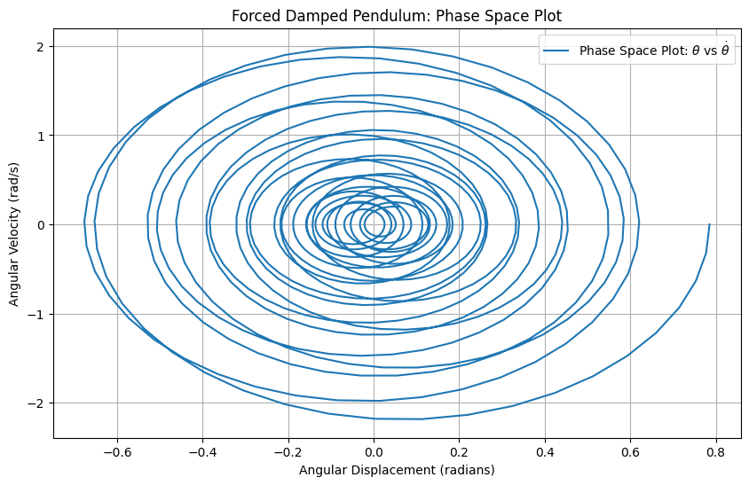
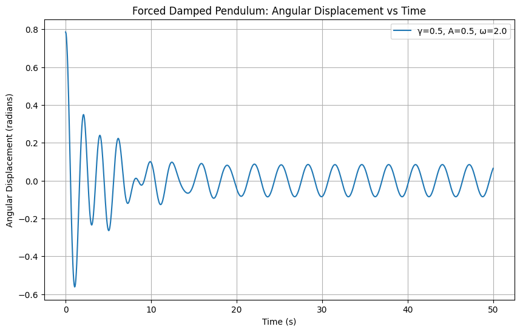

# Problem 2
---
# Motivation

The forced damped pendulum is a fascinating example of a physical system that exhibits complex dynamics due to the interplay between damping, restoring forces, and external driving forces. In many real-world systems, forces like damping and external driving forces significantly influence the behavior of oscillatory motion, leading to a variety of phenomena such as resonance, chaotic motion, and quasiperiodicity. Understanding these dynamics is essential not only in physics but also in fields like engineering, environmental science, and biomechanics.

# Investigating the Dynamics of a Forced Damped Pendulum

## 1. Theoretical Foundation

The motion of a forced damped pendulum can be described by the following second-order nonlinear differential equation:

$$
\frac{d^2 \theta}{dt^2} + \gamma \frac{d\theta}{dt} + \frac{g}{L} \sin(\theta) = A \cos(\omega t)
$$

Where:
- $\theta$ is the angular displacement,
- $\gamma$ is the damping coefficient,
- $g$ is the gravitational acceleration,
- $L$ is the length of the pendulum,
- $A$ is the amplitude of the driving force,
- $\omega$ is the frequency of the driving force.

### Small-Angle Approximation

For small angles ($\theta \ll 1$), we can approximate $\sin(\theta) \approx \theta$, leading to the following simplified linear equation:

$$
\frac{d^2 \theta}{dt^2} + \gamma \frac{d\theta}{dt} + \frac{g}{L} \theta = A \cos(\omega t)
$$

This is a linear second-order differential equation with constant coefficients, and its general solution can be found using standard methods for solving linear differential equations.

### Solution to the Homogeneous Equation

The homogeneous part of the equation ($A = 0$) is:

$$
\frac{d^2 \theta}{dt^2} + \gamma \frac{d\theta}{dt} + \frac{g}{L} \theta = 0
$$

This is a damped harmonic oscillator equation, whose solution depends on the discriminant $\Delta = \gamma^2 - 4 \frac{g}{L}$. The behavior of the system depends on this discriminant:

- If $\Delta > 0$ (overdamped), the system returns to equilibrium without oscillating.
- If $\Delta = 0$ (critically damped), the system returns to equilibrium as quickly as possible without oscillating.
- If $\Delta < 0$ (underdamped), the system oscillates with exponentially decaying amplitude.

### Forced Response

For a driven pendulum with $A \neq 0$, the solution takes the form of a particular solution superimposed on the homogeneous solution:

$$
\theta(t) = \theta_h(t) + \theta_p(t)
$$

Where $\theta_p(t)$ is the particular solution. This particular solution can be found using the method of undetermined coefficients, which leads to a solution of the form:

$$
\theta_p(t) = \frac{A}{\sqrt{(\omega_0^2 - \omega^2)^2 + (\gamma \omega)^2}} \cos(\omega t - \delta)
$$

Where:
- $\omega_0 = \sqrt{\frac{g}{L}}$ is the natural frequency of the pendulum,
- $\delta$ is the phase shift between the driving force and the pendulum's motion.

### Resonance Condition

Resonance occurs when the driving frequency $\omega$ matches the natural frequency $\omega_0$ of the pendulum. In this case, the amplitude of oscillation increases significantly due to the constructive interference between the driving force and the motion of the pendulum. The resonance condition is given by:

$$
\omega = \omega_0
$$

In this condition, the system can absorb energy from the driving force efficiently, which can lead to large oscillations.

## 2. Analysis of Dynamics

Now, let's explore how different parameters affect the dynamics of the forced damped pendulum.

### Parameters
- **Damping coefficient ($\gamma$)**: Controls the rate of energy loss. Increasing damping reduces oscillation amplitude.
- **Driving amplitude ($A$)**: Affects the amplitude of the oscillations, with larger values leading to larger oscillations.
- **Driving frequency ($\omega$)**: Determines the frequency of the external force. When close to the natural frequency, resonance occurs.

### Numerical Simulation

* We will use a numerical approach to simulate the dynamics of the forced damped pendulum for various values of the damping coefficient, driving amplitude, and driving frequency.

The equation will be solved using the **Runge-Kutta method**, which is an efficient way to solve differential equations numerically.

## 3. Python Implementation

import numpy as np
import matplotlib.pyplot as plt
from scipy.integrate import solve_ivp

# Parameters

$g = 9.81$ # gravitational acceleration (m/s^2)
$L = 1.0$  # length of the pendulum (m)
$gamma = 0.1$  # damping coefficient
$A = 1.0$  # amplitude of the external force
$omega = 1.0$ # driving frequency
$theta_0 = 0.2$  # initial angle (radians)
$theta_dot_0 = 0.0$ # initial angular velocity (rad/s)

# Natural frequency
$$
omega_0 = np.sqrt(g / L)
$$

# Differential equation for the forced damped pendulum
---
* $def pendulum_eq(t, y, gamma, A, omega, omega_0):$
$theta, theta_dot = y$
$dtheta_dt = theta_dot$
$dtheta_dot_dt = -gamma * theta_dot - (g / L) * np.sin(theta) + A * np.cos(omega * t)$
$return [dtheta_dt, dtheta_dot_dt]$

# Time span and initial conditions
$$
t_span = (0, 50)
y0 = [theta_0, theta_dot_0]
t_eval = np.linspace(0, 50, 1000)
$$

# Solve the differential equation using Runge-Kutta method
---
* $ sol = solve_ivp(pendulum_eq, t_span, y0, t_eval=t_eval, args=(gamma, A, omega, omega_0)) $

# Plotting the results
plt.figure(figsize=(10, 6))
plt.plot(sol.t, sol.y[0], label=r'$\theta(t)$')
plt.title('Forced Damped Pendulum Motion')
plt.xlabel('Time (s)')
plt.ylabel('Angle (radians)')
plt.grid(True)
plt.legend()
plt.show()

# Plot Phase Space (theta vs. theta_dot)

plt.figure(figsize=(10, 6))
plt.plot(sol.y[0], sol.y[1], label='Phase Space')
plt.title('Phase Space of the Forced Damped Pendulum')
plt.xlabel(r'$\theta$ (radians)')
plt.ylabel(r'$\dot{\theta}$ (rad/s)')
plt.grid(True)
plt.legend()
plt.show()

---
