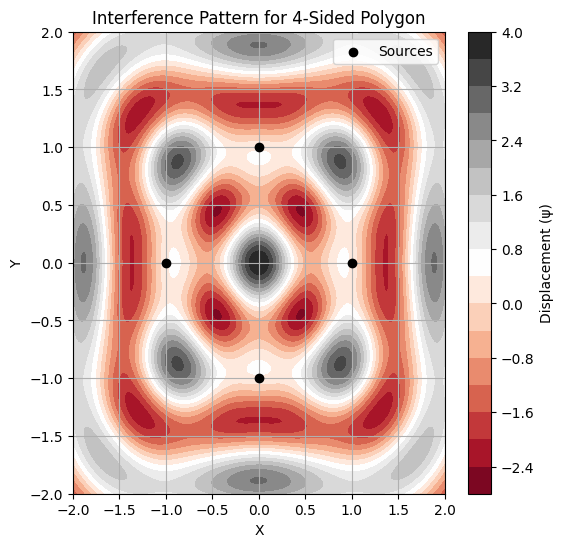
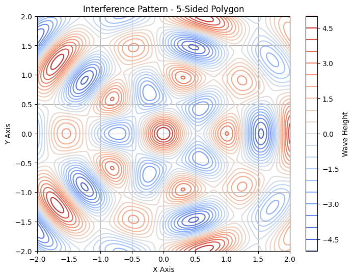

# Problem 1
# Waves Interference Patterns on a Water Surface

## Motivation

Interference occurs when waves from different sources overlap and create new patterns. On a water surface, this phenomenon can be easily observed when ripples from different points meet, forming distinct interference patterns. These patterns show how waves combine in different ways, either reinforcing each other (constructive interference) or canceling out (destructive interference).

By studying these patterns, we can better understand wave behavior in a simple and visual way. Additionally, it allows us to explore key concepts such as the relationship between wave phase and the effects of multiple sources. This task provides a hands-on approach to learning about wave interactions and their real-world applications, making it an engaging way to explore wave physics.

## Problem Statement

We are tasked with analyzing the interference patterns formed on a water surface due to the superposition of waves emitted from point sources placed at the vertices of a chosen regular polygon. The following steps outline the process:




### Steps to Follow:

1. **Select a Regular Polygon**: Choose a regular polygon (e.g., equilateral triangle, square, or regular pentagon).
2. **Position the Sources**: Place point wave sources at the vertices of the selected polygon.
3. **Wave Equations**: Write the equations describing the waves emitted from each source, considering their respective positions.
4. **Superposition of Waves**: Apply the principle of superposition by summing the wave displacements at each point on the water surface.
5. **Analyze Interference Patterns**: Examine the resulting displacement as a function of position and time. Identify regions of constructive interference (wave amplification) and destructive interference (wave cancellation).
6. **Visualization**: Present your findings graphically, illustrating the interference patterns for the chosen regular polygon.

### Key Considerations:

- All sources emit waves with the same amplitude $ A $, wavelength $ \lambda $, and frequency $ f $.
- The waves are coherent, meaning they maintain a constant phase difference.
- Use simulation and visualization tools, such as Python with Matplotlib, to aid in the analysis.

## Mathematical Model

A wave emanating from a point source on the water surface can be described by the **single disturbance equation**:

$$
\psi(\vec{r}, t) = A \cos(k |\vec{r} - \vec{r}_0| - \omega t + \phi)
$$

Where:
- $ \psi(\vec{r}, t) $ is the displacement of the water surface at point $ \vec{r} $ and time $ t $,
- $ A $ is the amplitude of the wave,
- $ k $ is the wave number, related to the wavelength $ \lambda $ by $ k = \frac{2\pi}{\lambda} $,
- $ \omega $ is the angular frequency, related to the frequency $ f $ by $ \omega = 2\pi f $,
- $ |\vec{r} - \vec{r}_0| $ is the distance from the source at position $ \vec{r}_0 $,
- $ \phi $ is the initial phase of the wave.


### Superposition of Waves

For multiple sources located at the vertices of a regular polygon, the total displacement at a point $ \vec{r} $ and time $ t $ is the sum of the individual displacements from each wave source. The **superposition principle** states:

$$
\Psi(\vec{r}, t) = \sum_{i=1}^{N} \psi_i(\vec{r}, t)
$$

Where:
- $ N $ is the number of sources (the vertices of the polygon),
- $ \psi_i(\vec{r}, t) $ is the displacement from the $ i $-th source.




## Python Code for Simulating Interference Patterns

Below is the Python code that simulates the interference pattern resulting from point sources placed at the vertices of a regular polygon. The code computes the superposition of the waves emitted by these sources and visualizes the resulting interference pattern.

### Python Script

```python
import numpy as np
import matplotlib.pyplot as plt

# Constants
A = 1.0  # Amplitude of the wave
k = 2 * np.pi / 1.0  # Wave number (for wavelength λ = 1)
omega = 2 * np.pi  # Angular frequency (for frequency f = 1)
phi = 0  # Initial phase
f = 1  # Frequency of the wave
t = 0  # Time at which the interference pattern is computed

# Define the polygon vertices
def polygon_vertices(sides, radius=1):
    """Calculate the vertices of a regular polygon inscribed in a circle."""
    angles = np.linspace(0, 2*np.pi, sides, endpoint=False)
    return np.array([[radius * np.cos(angle), radius * np.sin(angle)] for angle in angles])

# Wave function at each point (from a single source)
def wave(x, y, source, A, k, omega, t, phi):
    r = np.sqrt((x - source[0])**2 + (y - source[1])**2)
    return A * np.cos(k * r - omega * t + phi)

# Superposition of waves from multiple sources (polygon vertices)
def superposition(x, y, sources, A, k, omega, t, phi):
    total_wave = np.zeros_like(x)
    for source in sources:
        total_wave += wave(x, y, source, A, k, omega, t, phi)
    return total_wave

# Create grid of points
x = np.linspace(-2, 2, 400)
y = np.linspace(-2, 2, 400)
X, Y = np.meshgrid(x, y)

# Number of sides of the polygon (e.g., 3 for triangle, 4 for square)
sides = 4  # Change this for different polygons (3, 5, etc.)
sources = polygon_vertices(sides)

# Compute the superposition at all grid points
Z = superposition(X, Y, sources, A, k, omega, t, phi) .

# Plot the interference pattern
plt.figure(figsize=(6,6))
plt.contourf(X, Y, Z, 20, cmap='RdGy')
plt.colorbar(label='Displacement (ψ)')
plt.scatter(sources[:,0], sources[:,1], color='black', label='Sources', zorder=5)
plt.title(f'Interference Pattern for {sides}-Sided Polygon')
plt.xlabel('X')
plt.ylabel('Y')
plt.legend()
plt.show()


