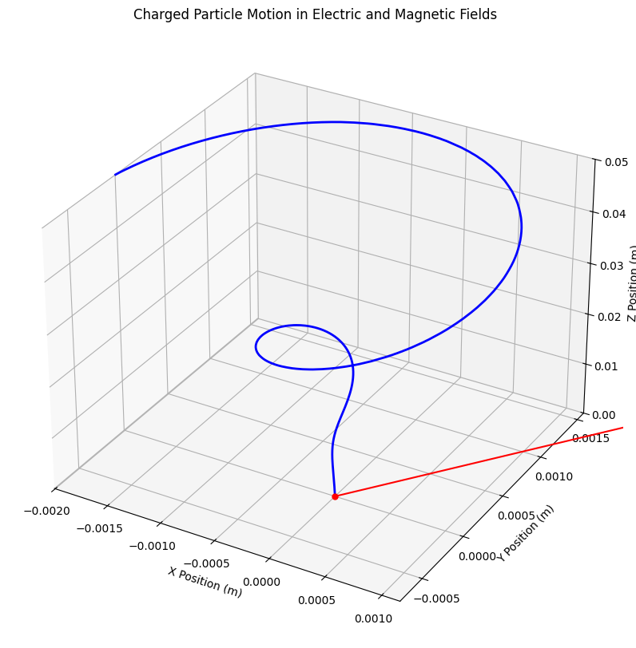

# Problem 1
%%markdown
# **Simulating the Effects of the Lorentz Force**

## **Motivation**
The Lorentz force governs the motion of charged particles in electric and magnetic fields. It is given by:

$$\mathbf{F} = q (\mathbf{E} + \mathbf{v} \times \mathbf{B})$$

where:
- $q$ is the charge of the particle,
- $\mathbf{E}$ is the electric field,
- $\mathbf{B}$ is the magnetic field,
- $\mathbf{v}$ is the velocity of the particle.

This force plays a crucial role in various physical systems such as:
- **Particle accelerators**
- **Mass spectrometers**
- **Plasma confinement (Tokamaks, Stellarators)**

By simulating the motion of charged particles, we can better understand the practical applications and visualize their trajectories.

---
## **1. Equations of Motion**
Using Newton’s second law:

$$m \frac{d\mathbf{v}}{dt} = q (\mathbf{E} + \mathbf{v} \times \mathbf{B})$$

Expanding this into components:

$m \frac{dv_x}{dt} = q (E_x + v_y B_z - v_z B_y)$
$m \frac{dv_y}{dt} = q (E_y + v_z B_x - v_x B_z)$
$m \frac{dv_z}{dt} = q (E_z + v_x B_y - v_y B_x)$

We numerically solve these equations using the Runge-Kutta or Euler method.

---
## **2. Implementation in Python**
```python
import numpy as np
import matplotlib.pyplot as plt
from scipy.integrate import solve_ivp

# Constants
q = 1.6e-19  # Charge (Coulombs)
m = 9.11e-31  # Mass (kg)
B = np.array([0, 0, 1])  # Uniform magnetic field in z-direction (Tesla)
E = np.array([0, 0, 0])  # Electric field (V/m)

# Equations of motion
def lorentz_force(t, y):
    x, y, z, vx, vy, vz = y
    v = np.array([vx, vy, vz])
    dvdt = (q/m) * (E + np.cross(v, B))
    return [vx, vy, vz, dvdt[0], dvdt[1], dvdt[2]]

# Initial conditions
x0, y0, z0 = 0, 0, 0
vx0, vy0, vz0 = 1e6, 0, 0  # Initial velocity (m/s)
y0 = [x0, y0, z0, vx0, vy0, vz0]

# Time range
t_span = (0, 1e-6)
t_eval = np.linspace(*t_span, 1000)

# Solve ODEs
sol = solve_ivp(lorentz_force, t_span, y0, t_eval=t_eval, method='RK45')

# Extract solutions
x, y, z = sol.y[0], sol.y[1], sol.y[2]

# Plot trajectory
fig = plt.figure(figsize=(8, 6))
ax = fig.add_subplot(111, projection='3d')
ax.plot(x, y, z, label='Particle Trajectory')
ax.set_xlabel('X (m)')
ax.set_ylabel('Y (m)')
ax.set_zlabel('Z (m)')
ax.set_title('Motion of a Charged Particle in a Magnetic Field')
ax.legend()
plt.show()
```

---
## **3. Results and Observations**
- The particle undergoes a **circular motion** due to the Lorentz force in a uniform magnetic field.
- When both $\mathbf{E}$ and $\mathbf{B}$ fields are present, the motion can become **helical** or exhibit an **E×B drift**.
- The **Larmor radius** (radius of circular motion) is given by:
  
  $$r_L = \frac{m v_\perp}{q B}$$
  
  where $v_\perp$ is the velocity perpendicular to $\mathbf{B}$.



---
## **4. Extensions and Further Work**
- Adding a **non-uniform magnetic field** to simulate more realistic systems like a Tokamak.
- Introducing time-dependent electric fields.
- Investigating **relativistic effects** at high velocities.

This simulation provides insights into the fundamental principles governing charged particle motion and their applications in physics and engineering.

