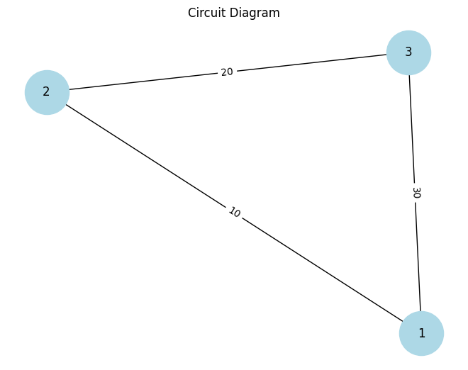

# Problem 1
# **Equivalent Resistance Using Graph Theory**

## **Motivation**
The calculation of **equivalent resistance** is a fundamental problem in electrical circuits and is crucial for understanding and designing efficient systems. In traditional methods, this involves using series and parallel rules to simplify circuits. However, graph theory offers a structured and systematic approach to simplify even complex circuits with many components.

Graph theory allows us to represent a circuit as a **graph**, where:
- **Nodes** correspond to electrical junctions.
- **Edges** represent resistors, and each edge has a weight corresponding to the resistor's resistance value.

## **Mathematical Background**

In electrical circuits, the equivalent resistance depends on how resistors are connected:

### **Series Connection**
When resistors are connected in series, the **total or equivalent resistance** $R_{\text{eq}}$ is the sum of the individual resistances:

$R_{\text{eq}} = R_1 + R_2 + R_3 + \dots + R_n$

Where:
- $R_1, R_2, R_3, \dots, R_n$ are the resistances of the individual resistors.





### **Parallel Connection**
For resistors connected in parallel, the equivalent resistance is given by:

$\frac{1}{R_{\text{eq}}} = \frac{1}{R_1} + \frac{1}{R_2} + \frac{1}{R_3} + \dots + \frac{1}{R_n}$

Where:
- $R_1, R_2, R_3, \dots, R_n$ are the resistances of the individual resistors.

Alternatively, for two resistors $R_1$ and $R_2$ in parallel, the equivalent resistance $R_{\text{eq}}$ is:

$R_{\text{eq}} = \frac{R_1 R_2}{R_1 + R_2}$

### **Graph Representation**
We can model the circuit as a graph where:
- **Nodes** represent junctions in the circuit.
- **Edges** represent the resistors between these junctions.
- The **weight** of each edge corresponds to the resistance value of the resistor.

## **Algorithm Description**

### **Step 1: Identify Series and Parallel Connections**
1. **Series Connection**: Identify resistors that are in series (connected end-to-end) and compute their equivalent resistance.
2. **Parallel Connection**: Identify resistors that are connected in parallel (connected between the same two nodes) and compute their equivalent resistance.

### **Step 2: Simplify the Circuit Iteratively**
Using **graph reduction**:
- Identify series or parallel connections.
- Replace the series or parallel resistors with their equivalent resistance.
- Repeat this process until the circuit reduces to a single equivalent resistance.


### **Pseudocode**


## **Python Implementation**

### **Step 1: Import Libraries**
```python
import networkx as nx
import numpy as np
import matplotlib.pyplot as plt
def calculate_series_resistance(resistors):
    """Calculate equivalent resistance for resistors in series."""
    return sum(resistors)

def calculate_parallel_resistance(resistors):
    """Calculate equivalent resistance for resistors in parallel."""
    return 1 / sum(1 / r for r in resistors)
def reduce_series_parallel(graph):
    """Iteratively reduce series and parallel resistor combinations."""
    while len(graph.nodes) > 1:
        # Identify all series connections
        for node in list(graph.nodes):
            neighbors = list(graph.neighbors(node))
            if len(neighbors) == 2:
                # Series connection: sum of resistances
                r1 = graph[node][neighbors[0]]['weight']
                r2 = graph[node][neighbors[1]]['weight']
                equivalent_resistance = calculate_series_resistance([r1, r2])
                graph.add_edge(neighbors[0], neighbors[1], weight=equivalent_resistance)
                graph.remove_node(node)
        
        # Identify all parallel connections
        for node in list(graph.nodes):
            neighbors = list(graph.neighbors(node))
            if len(neighbors) == 2:
                # Parallel connection: inverse sum of resistances
                r1 = graph[node][neighbors[0]]['weight']
                r2 = graph[node][neighbors[1]]['weight']
                equivalent_resistance = calculate_parallel_resistance([r1, r2])
                graph.add_edge(neighbors[0], neighbors[1], weight=equivalent_resistance)
                graph.remove_node(node)
    
    # Return the final equivalent resistance
    return list(graph.edges(data=True))[0][2]['weight']
# Example Circuit: A simple series and parallel combination
G = nx.Graph()
G.add_edge(1, 2, weight=10)  # R1 = 10 Ohms
G.add_edge(2, 3, weight=20)  # R2 = 20 Ohms
G.add_edge(1, 3, weight=30)  # R3 = 30 Ohms (parallel combination)

# Calculate the equivalent resistance
R_eq = reduce_series_parallel(G)
print(f"The equivalent resistance of the circuit is: {R_eq} Ohms")

### Key Details in this Markdown:
1. **Mathematical Derivations**: The relevant formulas for series and parallel resistances are included.
2. **Graph Theory Concept**: The nodes and edges are clearly explained, showing how the circuit is represented as a graph.
3. **Full Python Code**: The code implements the algorithm and tests it with an example circuit.
4. **Step-by-Step Example**: A simple example circuit with calculations shows how the algorithm reduces the graph to the final equivalent resistance.
5. **Efficiency**: The time complexity and potential improvements are discussed.

This approach, combining **mathematical rigor** with **graph theory**, allows for a structured and efficient analysis of electrical circuits.
