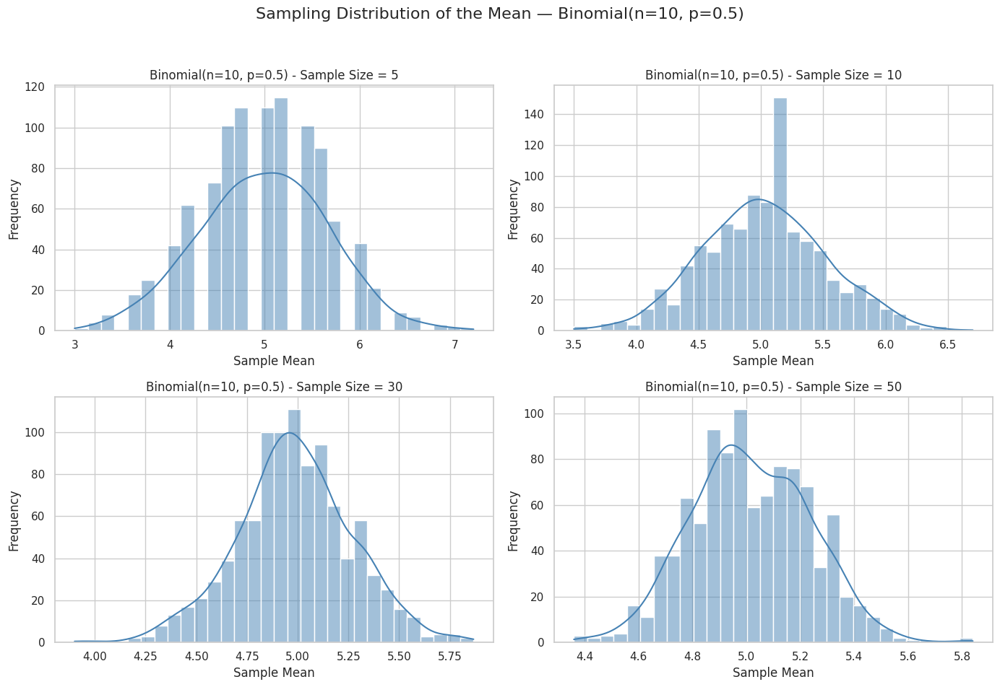

# Problem 1

---
# Motivation:
#
# The **Central Limit Theorem (CLT)** is a fundamental result in statistics that 
# states the following:
# 
# "The sampling distribution of the sample mean will tend to follow a **normal distribution** 
# as the sample size increases, regardless of the shape of the original population distribution."
#
# This means that even if the underlying population is not normally distributed, 
# if we take sufficiently large random samples and compute the sample mean, the distribution of the 
# sample means will converge to a normal distribution as the sample size increases.
#
# Mathematically, let X₁, X₂, ..., Xₙ be i.i.d. (independent and identically distributed) random variables 
# with a population mean μ and variance σ². Then the sample mean:
#
#     X̄ₙ = (1/n) * Σ Xᵢ  follows:
#     X̄ₙ ~ N(μ, σ²/n) approximately, as n → ∞
#
# This theorem holds true regardless of the original population distribution (e.g., Uniform, Exponential, Binomial).
# 
# By simulating different population distributions and calculating sample means, we can observe the CLT in action.
---
# Population size (large enough to approximate the "true" population)
population_size = 100000

# Generate different population distributions
uniform_population = np.random.uniform(low=0, high=1, size=population_size)
exponential_population = np.random.exponential(scale=1.0, size=population_size)
binomial_population = np.random.binomial(n=10, p=0.5, size=population_size)

# Sample sizes to test CLT convergence
sample_sizes = [5, 10, 30, 50]

# Number of samples to draw for each sample size
n_samples = 1000

# Function to compute sample means
def compute_sample_means(population, sample_size, n_samples):
    """
    Draws multiple samples from a population and computes the sample means.
    
    Parameters:
        population (array): the full population data
        sample_size (int): size of each sample
        n_samples (int): number of samples to draw
        
    Returns:
        np.array: array of sample means
    """
    sample_means = []
    for _ in range(n_samples):
        sample = np.random.choice(population, size=sample_size, replace=False)
        sample_mean = np.mean(sample)
        sample_means.append(sample_mean)
    return np.array(sample_means)

# Dictionary of distributions to analyze
distributions = {
    "Uniform(0,1)": uniform_population,
    "Exponential(λ=1)": exponential_population,
    "Binomial(n=10, p=0.5)": binomial_population
}

# Visualization of sample mean distributions
for dist_name, population in distributions.items():
    plt.figure(figsize=(14, 10))
    
    for i, size in enumerate(sample_sizes):
        means = compute_sample_means(population, sample_size=size, n_samples=n_samples)
        
        plt.subplot(2, 2, i + 1)
        sns.histplot(means, kde=True, bins=30, color='steelblue')
        plt.title(f'{dist_name} - Sample Size = {size}')
        plt.xlabel('Sample Mean')
        plt.ylabel('Frequency')
        
        # Empirical mean and variance of the sampling distribution
        empirical_mean = np.mean(means)
        empirical_std = np.std(means)
        
        # True population parameters
        pop_mean = np.mean(population)
        pop_var = np.var(population)
        
        # Theoretical standard deviation of the sample mean
        # σ/√n
        theoretical_std = np.sqrt(pop_var / size)
        
        print(f"Distribution: {dist_name} | Sample Size: {size}")
        print(f"  Population Mean (μ): {pop_mean:.4f}")
        print(f"  Population Variance (σ²): {pop_var:.4f}")
        print(f"  Empirical Mean of X̄: {empirical_mean:.4f}")
        print(f"  Empirical Std of X̄: {empirical_std:.4f}")
        print(f"  Theoretical Std of X̄: {theoretical_std:.4f}")
        print("-" * 60)
    
    plt.suptitle(f'Sampling Distribution of the Mean — {dist_name}', fontsize=16)
    plt.tight_layout(rect=[0, 0.03, 1, 0.95])
    plt.show()

# CLT Summary:
#
# Regardless of the original population distribution (uniform, skewed, discrete),
# as the sample size increases, the distribution of the sample mean approaches
# a normal distribution:
#
#    X̄ₙ ≈ N(μ, σ²/n)
#
# Key observations from simulation:
# - With small sample sizes (e.g., n=5), the shape of the population is still visible.
# - At n=30 or greater, all distributions begin to look approximately normal.
# - The variance of the sample mean decreases as sample size increases.

