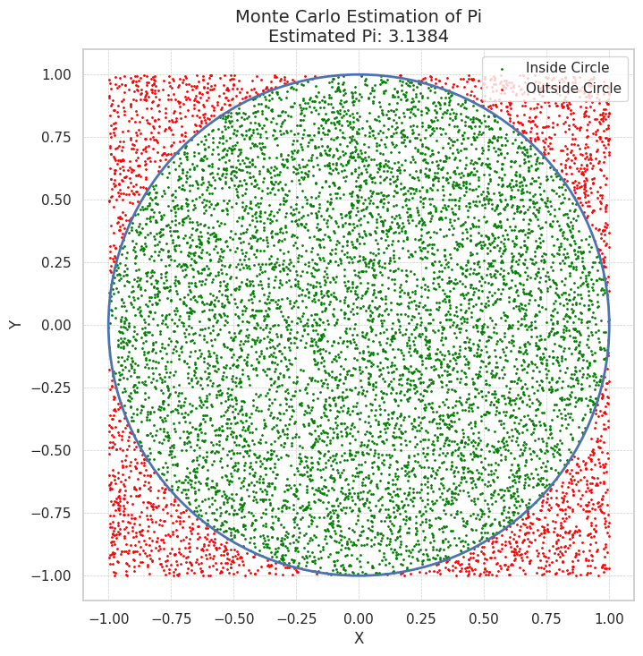

# Problem 2
# Estimating $\pi$ Using Monte Carlo Methods

## Motivation:
Monte Carlo simulations are a powerful class of computational techniques that use randomness to solve problems or estimate values. One of the most elegant applications of Monte Carlo methods is estimating the value of $\pi$ through geometric probability. By randomly generating points and analyzing their positions relative to a geometric shape, we can approximate $\pi$ in an intuitive and visually engaging way.

This problem connects fundamental concepts of probability, geometry, and numerical computation. It also provides a gateway to understanding how randomness can be harnessed to solve complex problems in physics, finance, and computer science. The Monte Carlo approach to $\pi$ estimation highlights the versatility and simplicity of this method while offering practical insights into convergence rates and computational efficiency.


## Part 1: Estimating $\pi$ Using a Circle

### 1. Theoretical Foundation:
- The ratio of points inside a circle to the total number of points in a square can be used to estimate $\pi$. 
- A unit circle with radius $r = 1$ is inscribed within a square with side length 2. The area of the circle is $A_{\text{circle}} = \pi r^2$, which simplifies to $\pi$ for $r = 1$.
- The area of the square is $A_{\text{square}} = 2 \times 2 = 4$.
- The ratio of points inside the circle to the total points can be used to approximate $\pi$:
  
$\pi = 4 \times \frac{N_{\text{inside}}}{N_{\text{total}}}$

Where:
- $N_{\text{inside}}$ is the number of points inside the circle.
- $N_{\text{total}}$ is the total number of points generated in the square.

### 2. Simulation:
- Generate random points within a square with dimensions from -1 to 1 in both $x$ and $y$ directions.
- Check whether each point lies inside the unit circle by testing if:

$x^2 + y^2 \leq 1$

If true, the point is inside the circle.

### 3. Visualization:
- Create a plot showing the random points in the square.
- Points inside the circle will be shown in one color, and points outside will be in another color.
- Display the circle and square for clarity.

### 4. Analysis:
- Investigate how the accuracy of the estimate improves as the number of points increases.
- Discuss the convergence rate and computational considerations for this method.

---

## Part 2: Estimating $ \pi $ Using Buffon’s Needle

### 1. Theoretical Foundation:
- The Buffon’s Needle problem involves dropping a needle of length $L$ onto a plane with parallel lines spaced a distance $D$ apart.
- The probability of the needle crossing a line depends on the angle of the needle and its distance to the nearest line.
- The formula for estimating $\pi$ based on this probability is:

$\pi = \frac{2L N_{\text{drops}}}{D N_{\text{crosses}}}$

Where:
- $L$ is the length of the needle.
- $D$ is the distance between the parallel lines.
- $N_{\text{crosses}}$ is the number of times the needle crosses a line.
- $N_{\text{drops}}$ is the total number of needle drops.

### 2. Simulation:
- Simulate the random dropping of a needle onto a plane with parallel lines.
- For each drop, calculate the distance from the needle’s midpoint to the nearest line and the angle of the needle.
- Determine whether the needle crosses a line based on the geometric conditions.

### 3. Visualization:
- Create a graphical representation of the simulation.
- Show the positions of the needles and whether they cross a line or not.

### 4. Analysis:
- Explore how the number of needle drops affects the estimate’s accuracy.
- Compare the convergence rate of this method to the circle-based approach.



### 3. Python Code for Circle-Based Method:

```python
import numpy as np
import matplotlib.pyplot as plt

# Function to estimate π using Monte Carlo method based on circle
def estimate_pi_circle(n_points):
    # Generate random points (x, y) in the square [-1, 1] x [-1, 1]
    x = np.random.uniform(-1, 1, n_points)
    y = np.random.uniform(-1, 1, n_points)
    
    # Calculate the distance of each point from the origin (x^2 + y^2)
    distance_squared = x**2 + y**2
    
    # Count the points inside the unit circle (x^2 + y^2 <= 1)
    points_inside_circle = np.sum(distance_squared <= 1)
    
    # Estimate π using the ratio of points inside the circle
    # π = 4 * (points inside circle) / (total points)
    pi_estimate = 4 * points_inside_circle / n_points
    
    return pi_estimate, x, y, distance_squared <= 1

# Run the simulation for 10,000 points
n_points = 10000
pi_estimate, x, y, inside_circle = estimate_pi_circle(n_points)

# Visualize the points and the circle
plt.figure(figsize=(6,6))
plt.scatter(x[inside_circle], y[inside_circle], color='green', s=1, label='Inside Circle')
plt.scatter(x[~inside_circle], y[~inside_circle], color='red', s=1, label='Outside Circle')
plt.gca().set_aspect('equal', adjustable='box')
plt.title(f"Monte Carlo Estimation of $\\pi$\nEstimated $\\pi$: {pi_estimate:.4f}")
plt.xlabel('X')
plt.ylabel('Y')
plt.legend()
plt.grid(True)
plt.show()
```

# Function to simulate Buffon's Needle
def estimate_pi_buffon(needle_length, line_distance, n_drops):
    crosses = 0
    for _ in range(n_drops):
        # Randomly generate the distance from the needle's midpoint to the nearest line
        dist_to_line = np.random.uniform(0, line_distance / 2)
        
        # Randomly generate the angle of the needle (uniformly between 0 and π/2)
        angle = np.random.uniform(0, np.pi / 2)
        
        # Check if the needle crosses the line
        if dist_to_line <= (needle_length / 2) * np.sin(angle):
            crosses += 1
    
    # Estimate π using Buffon's Needle formula
    pi_estimate = (2 * needle_length * n_drops) / (line_distance * crosses)
    
    return pi_estimate

# Run the simulation for Buffon's Needle
needle_length = 1  # length of the needle (L)
line_distance = 2  # distance between parallel lines (D)
n_drops = 10000    # number of needle drops (N_drops)

# Estimate π using Buffon's Needle method
pi_estimate_buffon = estimate_pi_buffon(needle_length, line_distance, n_drops)
print(f"Estimated π using Buffon's Needle: {pi_estimate_buffon:.4f}")
