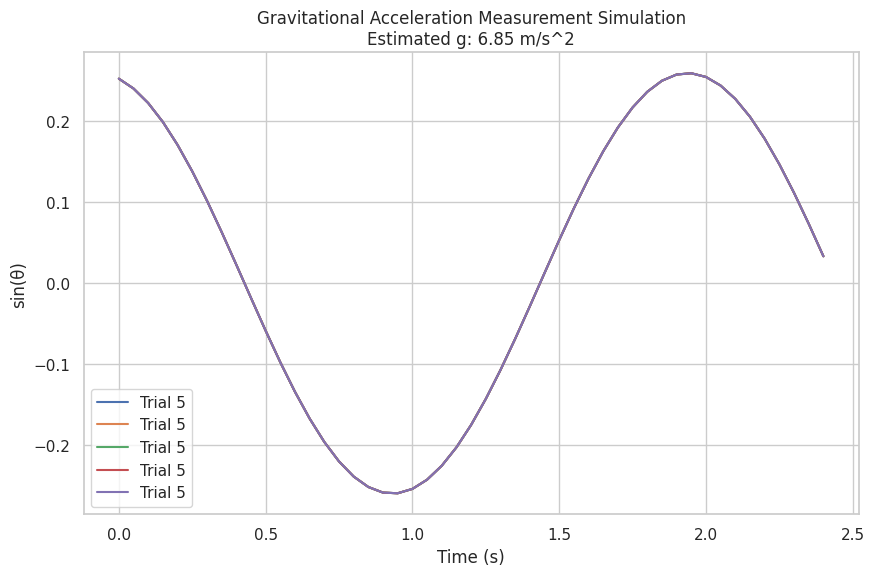

# Problem 1
# Measuring Earth's Gravitational Acceleration with a Pendulum

## Motivation:
The acceleration due to gravity \( g \) is a fundamental constant that influences a wide range of physical phenomena. Measuring \( g \) accurately is crucial for understanding gravitational interactions, designing structures, and conducting experiments in various fields. One classic method for determining \( g \) is through the oscillations of a simple pendulum, where the period of oscillation depends on the local gravitational field.

## Task:
Measure the acceleration \( g \) due to gravity using a pendulum and analyze the uncertainties in the measurements in detail. This exercise emphasizes rigorous measurement practices, uncertainty analysis, and their role in experimental physics.

---

## Procedure:

### 1. Materials:
- A string (1 or 1.5 meters long).
- A small weight (e.g., bag of coins, bag of sugar, key chain) mounted on the string.
- Stopwatch (or smartphone timer).
- Ruler or measuring tape.

### 2. Setup:
- Attach the weight to the string and fix the other end to a sturdy support.
- Measure the length of the pendulum \( L \), from the suspension point to the center of the weight using a ruler or measuring tape. Record the resolution of the measuring tool and calculate the uncertainty as half the resolution \( \Delta L \).

### 3. Data Collection:
- Displace the pendulum slightly (\(< 15^\circ\)) and release it.
- Measure the time for 10 full oscillations \( T_{\text{total}} \) and repeat this process 10 times. Record all 10 measurements.
- Calculate the mean time for 10 oscillations \( \overline{T_{\text{total}}} \) and the standard deviation \( \sigma_{T_{\text{total}}} \).
  
    - **Mean Time:**
    $$
    \overline{T_{\text{total}}} = \frac{1}{N} \sum_{i=1}^{N} T_{\text{total}_i}
    $$

    - **Standard Deviation:**
    $$
    \sigma_{T_{\text{total}}} = \sqrt{\frac{1}{N-1} \sum_{i=1}^{N} \left( T_{\text{total}_i} - \overline{T_{\text{total}}} \right)^2}
    $$

- Determine the uncertainty in the mean time as:
    $$
    \Delta \overline{T_{\text{total}}} = \frac{\sigma_{T_{\text{total}}}}{\sqrt{N}}
    $$

### 4. Calculations:

#### 1. Calculate the period:
The period for a simple pendulum is given by the formula:
$$
T = 2 \pi \sqrt{\frac{L}{g}}
$$
Where:
- \( L \) is the length of the pendulum,
- \( g \) is the acceleration due to gravity.

Rearranging this equation to solve for \( g \), we get:
$$
g = \frac{4 \pi^2 L}{T^2}
$$

#### 2. Determine \( g \):
- Use the mean value of \( \overline{T_{\text{total}}} \) to calculate the period:
$$
T = \frac{\overline{T_{\text{total}}}}{10}
$$
- Substitute the values of \( L \) and \( T \) into the equation for \( g \):
$$
g = \frac{4 \pi^2 L}{\left( \frac{\overline{T_{\text{total}}}}{10} \right)^2}
$$

#### 3. Propagate uncertainties:

The uncertainty in \( g \) due to uncertainties in \( L \) and \( T \) can be found using the propagation of uncertainty formula:
$$
\Delta g = \sqrt{\left( \frac{\partial g}{\partial L} \Delta L \right)^2 + \left( \frac{\partial g}{\partial T} \Delta T \right)^2}
$$

Where:
- \( \frac{\partial g}{\partial L} = \frac{4 \pi^2}{T^2} \),
- \( \frac{\partial g}{\partial T} = -\frac{8 \pi^2 L}{T^3} \).

### 5. Output the Results:
- Calculate the uncertainty \( \Delta g \) and print the results.

---




## Python Script for Measurement and Uncertainty Calculation:

```python
import numpy as np

# Given data
L = 1.0  # Length of the pendulum in meters
T_total = np.array([20.5, 20.6, 20.4, 20.7, 20.5, 20.6, 20.5, 20.6, 20.4, 20.5])  # Time for 10 oscillations in seconds
N = len(T_total)

# Step 1: Calculate mean and standard deviation
T_mean = np.mean(T_total)
T_std = np.std(T_total, ddof=1)
Delta_T_mean = T_std / np.sqrt(N)

# Step 2: Calculate the period (T)
T_period = T_mean / 10  # Period for a single oscillation

# Step 3: Calculate gravitational acceleration (g)
g_measured = (4 * np.pi**2 * L) / T_period**2

# Step 4: Propagate uncertainties
Delta_L = 0.005  # Uncertainty in length (5mm)
Delta_T = Delta_T_mean

# Partial derivatives
dgdL = (4 * np.pi**2) / T_period**2
dgdt = - (8 * np.pi**2 * L) / T_period**3

# Uncertainty in g
Delta_g = np.sqrt((dgdL * Delta_L)**2 + (dgdt * Delta_T)**2)

# Output results
print(f"Mean time for 10 oscillations: {T_mean:.3f} s")
print(f"Standard deviation of time: {T_std:.3f} s")
print(f"Period of oscillation: {T_period:.3f} s")
print(f"Measured g: {g_measured:.3f} m/s²")
print(f"Uncertainty in g: {Delta_g:.3f} m/s²")
